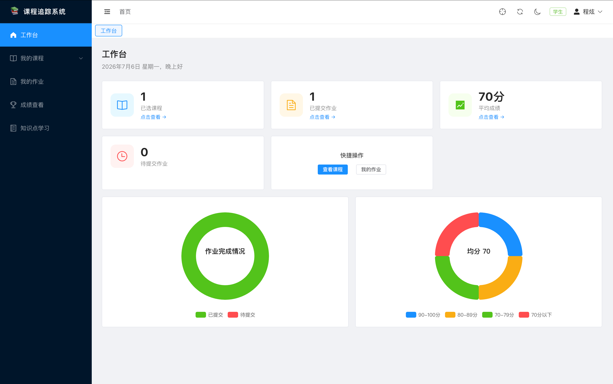
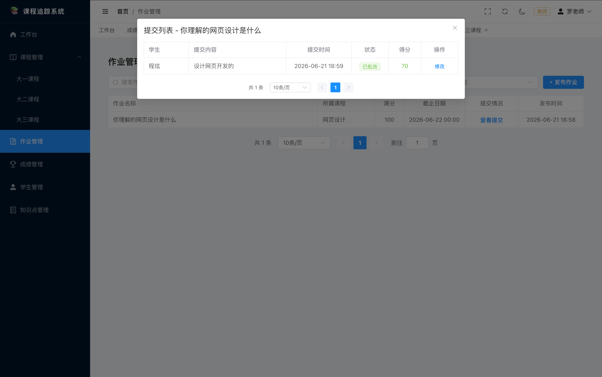
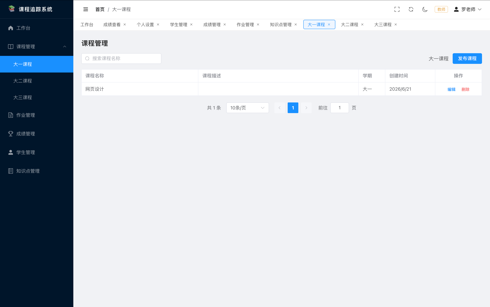
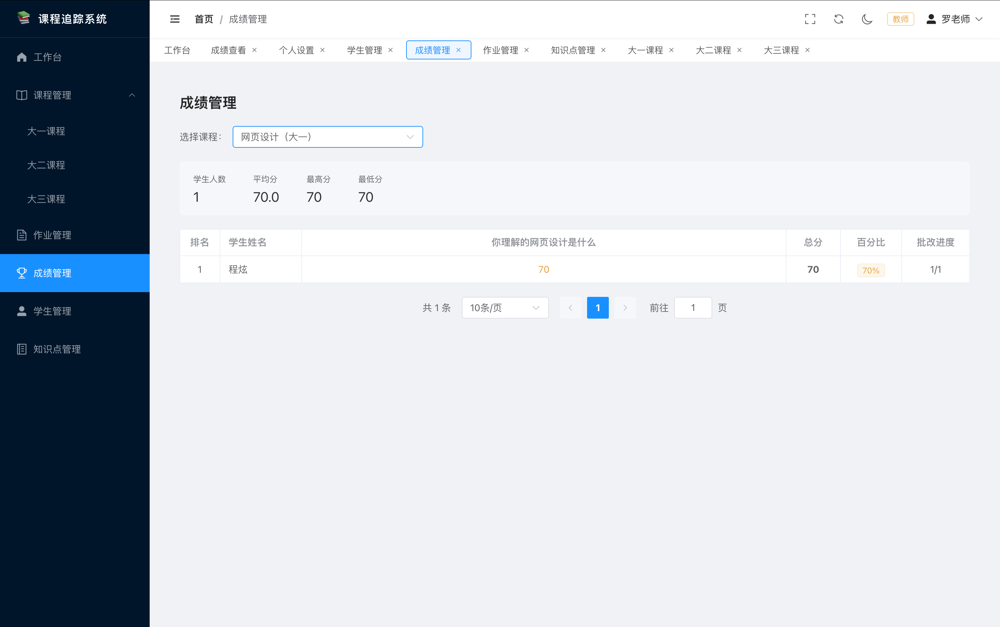
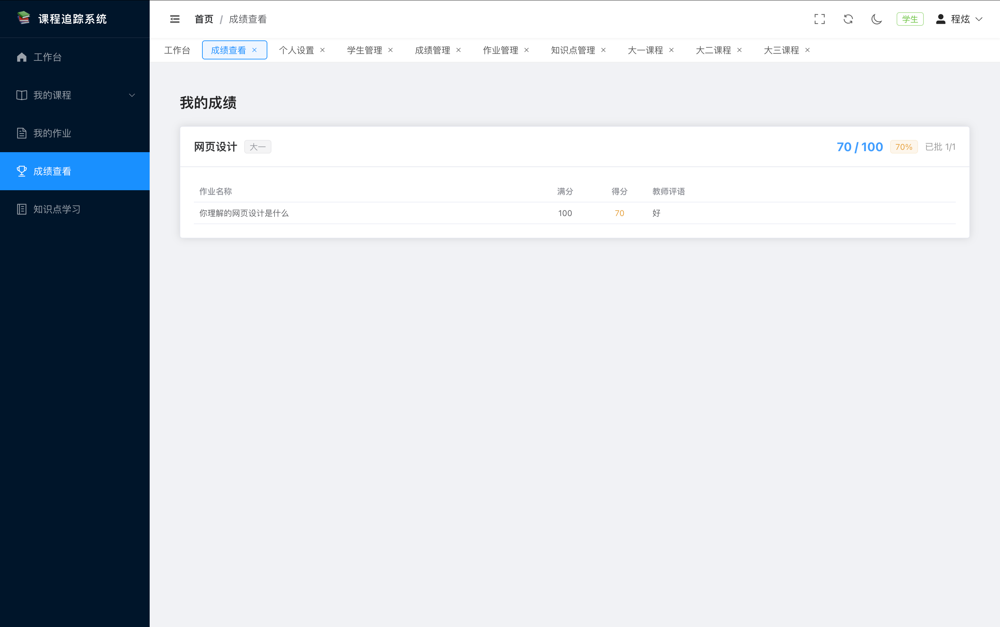

# 课程追踪系统 (CourseTrack)

一个基于 **Vue 3 + Element Plus + Express + MySQL** 的全栈课程管理平台，支持**教师**和**学生**双角色，覆盖课程发布、作业提交、成绩管理和知识点学习等核心教学场景。

## 项目截图

<div align="center">
  
  
  
  
  
</div>

## 功能概览

### 学生端
- 按学期浏览课程（大一 / 大二 / 大三）
- 查看作业并在线提交
- 查看成绩与教师评语
- 按模块学习知识点（理论 / 实践 / 拓展）

### 教师端
- 创建和管理课程、作业、知识点
- 查看学生提交并批改打分
- 按课程查看全班成绩排名
- 学生管理，查看学习统计

### 通用
- JWT 登录认证，按角色动态渲染菜单
- 暗色 / 亮色主题切换
- 标签页式多页面导航
- 仪表盘数据概览

## 技术栈

| 层级 | 技术 |
|------|------|
| 前端框架 | Vue 3 (Composition API) |
| 构建工具 | Vite 5 |
| UI 框架 | Element Plus |
| 状态管理 | Pinia |
| 路由 | Vue Router 4 |
| 图表 | ECharts 5 |
| HTTP 客户端 | Axios |
| 后端框架 | Express 5 |
| ORM | Sequelize 6 |
| 数据库 | MySQL |
| 认证 | JWT (jsonwebtoken + bcryptjs) |

## 项目结构

```
vue-course-tracker-v2/
├── frontend/                # Vue 3 前端
│   ├── src/
│   │   ├── api/             # API 请求封装 (axios)
│   │   ├── components/      # 通用组件 (图表、表格、侧边栏等)
│   │   ├── composables/     # 组合式函数
│   │   ├── router/          # 路由 + 导航守卫
│   │   ├── stores/          # Pinia 状态管理 (user, tabs, theme)
│   │   ├── views/           # 页面组件
│   │   │   ├── common/      # 公共页面 (Dashboard, Settings, 404)
│   │   │   ├── student/     # 学生端页面
│   │   │   └── teacher/     # 教师端页面
│   │   └── utils/           # 工具函数
│   └── .env.development     # 开发环境变量
├── backend/                 # Express 后端
│   ├── config/              # 数据库配置
│   ├── middleware/           # JWT 认证中间件
│   ├── models/              # Sequelize 数据模型
│   ├── routes/              # API 路由
│   └── utils/               # 工具函数 (分页等)
└── railway.toml             # Railway 部署配置
```

## 本地运行

### 环境要求
- Node.js >= 18
- MySQL 数据库

### 1. 克隆项目

```bash
git clone https://github.com/cx400/vue-course-tracker-v2.git
cd vue-course-tracker-v2
```

### 2. 配置数据库

在 MySQL 中创建数据库，然后编辑 `backend/.env`：

```env
DB_NAME=你的数据库名
DB_USER=数据库用户名
DB_PASSWORD=数据库密码
DB_HOST=localhost
DB_PORT=3306
JWT_SECRET=你的JWT密钥
```

### 3. 安装依赖并启动

```bash
# 安装后端依赖并启动 (端口 3000)
cd backend
npm install
node app.js

# 新开终端，安装前端依赖并启动 (端口 5173)
cd frontend
npm install
npm run dev
```

启动后访问 `http://localhost:5173`，数据库表会自动创建。

### 4. 注册使用

- 注册时选择角色（教师/学生）
- 教师账号可以创建课程、发布作业
- 学生账号可以查看课程、提交作业

## API 接口概览

| 模块 | 路径前缀 | 主要功能 |
|------|---------|----------|
| 用户 | `/api/user` | 注册、登录、个人信息管理 |
| 课程 | `/api/course` | 课程 CRUD，按学期筛选 |
| 作业 | `/api/assignment` | 作业发布、查看、提交 |
| 提交 | `/api/submission` | 提交批改、评分 |
| 成绩 | `/api/grade` | 个人成绩、全班成绩排名 |
| 知识点 | `/api/knowledge` | 知识点 CRUD |
| 仪表盘 | `/api/dashboard` | 统计数据概览 |
